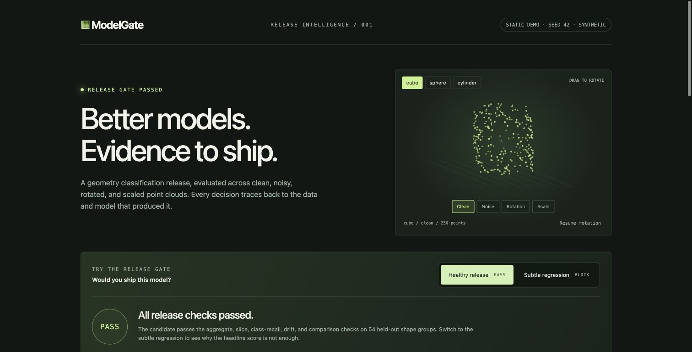

# ModelGate

[](https://github.com/bowenzhu21/modelgate/actions/workflows/ci.yml)


**A model release should come with evidence.** ModelGate trains real geometry classifiers, tests their behavior under distribution shifts, and refuses promotion when the model, evidence, or release policy does not agree.

[Explore the interactive report](https://bowenzhu21.github.io/modelgate/) · [Architecture](docs/architecture.md) · [Tradeoffs & limitations](docs/limitations.md)

[](https://bowenzhu21.github.io/modelgate/)

This is an independent ML platform engineering project by **Bowen Zhu**. The geometry task is an explicitly synthetic demonstration: surface point clouds for cubes, spheres, and cylinders. It makes no claim about real CAD assemblies, manufacturing defects, or production model quality.

## The result you can reproduce

On the included seed-42 fixture, the CPU-trained invariant classifier reaches **97.22% accuracy**, compared with **58.33%** for an intentionally simple axis-dependent baseline. Evaluation uses **54 independent held-out shape groups**, each represented in four conditions, for **216 evaluated samples**. Those 216 samples are not statistically independent.

The more useful result is a failure: a controlled model-bias defect still scores **92.13% overall**, above the 88% floor, but gets only **72.22% recall on noisy cylinders**. ModelGate blocks it. The figures come from executing the model, not hand-written report data.

Other demonstrated behaviors:

- Train/test splitting keeps every transformed version of a latent shape together.
- JSON-only model weights and SHA-256 content addresses; no pickle or executable model loading.
- Checks overall accuracy, each slice, each slice/class recall, log loss, paired group-bootstrap improvement, and feature drift.
- Promotion repeats evaluation and requires exact agreement with the supplied report.
- After the first release, the comparison baseline must be the active model.
- A writer lock, immutable content objects, and an atomic release pointer make concurrent publication safe on a local POSIX filesystem.
- Rollback restores a previously approved model and records a new immutable event.
- A self-contained HTML report works offline, including interactive confusion matrices and a 3D point-cloud preview.

## Run it

Requires Python **3.11–3.13**, macOS or Linux. NumPy **2.2.6** is the only runtime dependency. No account, API key, GPU, dataset download, or service is required.

```sh
git clone https://github.com/bowenzhu21/modelgate.git
cd modelgate
make install
make test
make demo
```

Open `demo-output/report.html` in a browser. `make demo` generates the dataset, trains models, evaluates good and bad releases, exercises tampering, promotes a successor, and rolls it back. It fails with a nonzero exit code if any expected safety behavior fails.

The versioned JSON reports are deliberately small. Generated point clouds, weights, and registry objects live in ignored `demo-output/artifacts/`. Re-running the command regenerates them locally. The checked-in HTML is a **static snapshot of a real demo run**, not a live model endpoint.

Without Make:

```sh
python3 -m venv .venv
.venv/bin/python -m pip install -e .
.venv/bin/python -m unittest discover -s tests -v
.venv/bin/modelgate demo --out demo-output
```

## Work through the release lifecycle

```sh
# Seeded data: 108 training groups, 54 holdout groups, 256 points per cloud.
.venv/bin/modelgate generate --out runs/dataset.json --seed 42

# Both standardizers and both classifiers see clean training records only.
.venv/bin/modelgate train --dataset runs/dataset.json \
  --features axis-v1 --out runs/baseline.json
.venv/bin/modelgate train --dataset runs/dataset.json \
  --features invariant-v2 --out runs/candidate.json

# Exit 0 = PASS; exit 3 = valid evidence blocked by policy; exit 2 = invalid artifact.
.venv/bin/modelgate evaluate --dataset runs/dataset.json \
  --baseline runs/baseline.json --candidate runs/candidate.json \
  --out runs/evaluation.json

.venv/bin/modelgate promote --dataset runs/dataset.json \
  --baseline runs/baseline.json --candidate runs/candidate.json \
  --report runs/evaluation.json --registry runs/registry

.venv/bin/modelgate inspect --registry runs/registry
```

To promote a second model, evaluate it against the active candidate, then use that same candidate as `--baseline` during promotion. `modelgate rollback --registry runs/registry` restores the immediately preceding release. Calling rollback again undoes the rollback; it does not automatically walk backward through history.

## How the classifier works

The baseline extracts axis-aligned extents, per-axis variances, and mean radius. The candidate extracts normalized covariance eigenvalues, normalized radial quantiles, radial variation, and the residual variation of an algebraic sphere fit. Candidate features are invariant to rigid rotation, translation, and uniform scale up to floating-point precision.

Both fit a standardizer using training data only, then learn a three-class softmax linear classifier with full-batch gradient descent, L2 regularization, zero initialization, and fixed hyperparameters. The candidate's improvement comes from useful geometric inductive bias. This is **not a neural-network benchmark or a comparison against a strong point-cloud model**.

The generator samples shape surfaces, generates additive noise, applies a random orthogonal rotation, and applies a 0.35× or 2.8× scale stress. Data artifacts describe their generation seed, schema, and group counts. Validation rejects missing transforms, duplicate sample IDs, invalid coordinates, degenerate clouds, and any group crossing the train/test boundary.

## Release policy

The versioned policy is in `src/modelgate/evaluation.py`. Thresholds are illustrative engineering choices for this fixture, not production-calibrated acceptance criteria.

| Required evidence | Threshold |
|---|---:|
| Overall candidate accuracy | ≥ 88% |
| Every slice's accuracy | ≥ 82% |
| Overall and every slice/class recall | ≥ 80% |
| Accuracy change versus baseline | ≥ 0 percentage points |
| Log-loss increase versus baseline | ≤ 0.03 |
| Paired group-bootstrap 95% lower improvement | ≥ −3 percentage points |
| Mean feature PSI in every slice | ≤ 4.0 |
| Independent holdout groups | ≥ 24 |

The bootstrap resamples **shape groups**, preserving correlation between transforms. PSI bins come only from clean training features, with 0.5 pseudo-count smoothing. Missing metrics, NaN, inconsistent confusion matrices, or mismatched hashes are invalid evidence; they never become a passing score.

## Reproducibility and measurement

```sh
make benchmark
```

`demo-output/benchmark.json` records three real CPU wall-time runs, medians for generation/training/evaluation, environment versions, data size, and content hashes. It excludes networking and registry writes. Timings are local observations, not a throughput guarantee.

The seed, algorithms, and NumPy version are fixed. Repeating in the same numerical environment produces identical data/model/report hashes. Different BLAS implementations, architectures, or numerical library versions can change low-order floating-point bits. Cross-platform correctness tests use tolerances where appropriate; **bit-identical hashes across every machine are not promised**. Regenerate the report in the promotion environment: promotion intentionally fails if its recomputed evidence differs from an imported report.

## What is tested

The unittest suite checks deterministic artifacts, group separation, holdout exclusion from training, geometric invariance, strict schemas, malformed JSON, nonfinite values, missing metrics, dataset and training-subset hashes, real bad-model rejection, aggregate-masked slice failures, stale baseline rejection, concurrent idempotent promotion, tampered evidence, corrupted stored objects, and rollback lineage. CI runs on Python 3.11 and 3.12.

## Layout

```text
src/modelgate/
  artifacts.py     strict JSON, content hashes, atomic file writes
  data.py          synthetic point clouds and group schema validation
  model.py         feature extraction and softmax training/inference
  evaluation.py    metrics, group bootstrap, drift, release policy
  registry.py      locked promotion, content objects, rollback
  report.py        self-contained interactive HTML
  cli.py           repeatable command-line workflows
tests/             behavioral and failure-path tests
demo-output/       observed evaluation, failure drills, environment, report
docs/              design and limitations
```

The transferable part is the artifact → evidence → policy → release contract. The classifier and point-cloud schema are deliberately concrete and can be replaced by another domain adapter. This repository does not claim to be a general-purpose model-serving platform.

MIT License · Copyright 2026 Bowen Zhu
