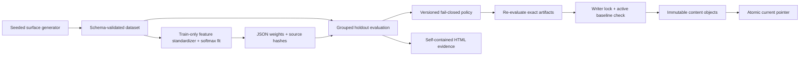

# Architecture and design decisions

## Pipeline

## Data leakage boundary

A group identifies a latent shape before any transformation. A separate seeded permutation assigns whole groups to train or test, independently for each class. All clean/noisy/rotated/scaled variants inherit that split. Validation checks the boundary again rather than assuming the generator was used.

The normalizer and model fit on `split=train`, `slice=clean`. The serialized artifact stores the hash of the complete source dataset, all training records, and the exact fitting subset. Evaluation recomputes all three relationships and verifies the fitting sample count. A test scales every held-out cloud and verifies that learned weights and normalization remain byte-identical.

The bootstrap operates on the average paired correctness change for each group. Treating 216 variants as 216 independent examples would give misleading uncertainty because there are only 54 independent latent shapes.

## Artifact contract

Artifacts are plain JSON. Parsing rejects duplicate object keys and nonfinite numbers. Canonical serialization uses sorted keys, fixed separators, a trailing newline, and `allow_nan=False`; SHA-256 is computed over those canonical bytes. Whitespace changes alone do not invalidate an artifact. Content changes do.

Weights, dimensions, numerical types, feature versions, and normalization bounds are validated before matrix multiplication. No pickle, joblib, dynamic imports, executable models, or object arrays are loaded. An unknown feature version is an error.

Hashes provide consistency and corruption detection. They do not establish who trained the model or prove a claimed training history. The fitting-subset hashes are recomputed, but promotion does not retrain the model. The local caller, code, and registry directory are trusted. There are no signatures or remote identities.

## Evidence contract

`evaluate()` computes baseline and candidate probabilities on exactly the same held-out records. It derives per-slice and aggregate confusion matrices, accuracy, log loss, and class recall. It also computes group-bootstrap bounds and train-to-holdout feature drift.

`assess()` validates required fields, finite values, confusion-matrix support, aggregate/slice consistency, weighted log-loss consistency, and comparison deltas before applying policy. A malformed metric raises an integrity error. A well-formed weak model produces `BLOCK` with concrete reasons. These are distinct failure classes and CLI exit codes.

The default release profile requires every slice/class recall to meet the floor. The demo's +0.5 cube-bias mutation is valuable because its aggregate accuracy remains acceptable while noisy-cylinder recall fails. The numbers are obtained by running the altered artifact through the same evaluator.

## Promotion transaction

1. Re-evaluate the provided dataset, baseline, and candidate.
2. Require exact canonical equality with the supplied report and a passing policy decision.
3. Acquire an exclusive advisory `flock` on the registry.
4. Verify the current pointer and referenced content hashes.
5. Treat an identical model/report promotion as an idempotent no-op.
6. For an actual subsequent release, require the supplied baseline hash to match the active model hash. This check occurs under the writer lock, preventing a stale comparison from winning a race.
7. Save immutable, content-addressed model/evaluation/release objects. Flush and sync each file, atomically rename it, and sync its directory.
8. Atomically replace `current.json` with the release address.

Readers need no lock: they observe either the old complete pointer or the new complete pointer, and all referenced objects are published before the pointer. A crash before publication may leave unreachable objects but does not expose a partial release. Garbage collection is intentionally absent.

Read-only file modes discourage accidental object changes; every read still verifies its hash. They are not an operating-system sandbox. This design targets one local macOS/Linux filesystem, not a distributed network filesystem.

## Rollback

Rollback validates the preceding release's model/evidence and writes a new event restoring that model. The previous events remain immutable. Its parent is the release being undone and its `restored_release_sha256` names the recovered event. Repeating rollback undoes the latest rollback, so the behavior is an explicit undo operation, not “walk backward through all historical promotions.”

## Extending the project

The reusable seam is `dataset → safe model artifact → evaluation evidence → policy → registry transaction`. A new task should define a new data/feature/model schema and a versioned policy, then extend or replace its evaluator. It should not silently reuse geometric thresholds or label definitions. A production extension would need a separate model-selection split, signed provenance, remote object storage with conditional writes, audit identities, an approval policy, and task-calibrated statistical tests.
